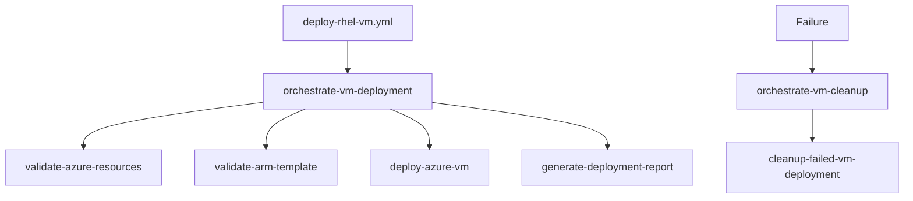

# Consolidated VM Deployment Architecture

## Overview

The VM deployment system has been **consolidated** to a single, clean orchestrated workflow that handles all deployment scenarios through the power of composite actions.

## 🎯 **Consolidation Results**

### Before Consolidation
- ❌ `deploy-rhel-vm.yml` - RHEL-specific deployment
- ❌ `deploy-rhel-vm-clean.yml` - Clean RHEL deployment (redundant)
- ❌ `deploy-vm-modular.yml` - General VM deployment (legacy)
- ❌ `deploy-vm-clean.yml` - Clean general VM deployment
- ❌ Multiple overlapping workflows with duplicated functionality

### After Consolidation
- ✅ **`deploy-rhel-vm.yml`** - Single consolidated orchestrated trigger
- ✅ All deployment complexity encapsulated in reusable composite actions
- ✅ Support for multiple VM types through parameterization
- ✅ Clean, maintainable, single source of truth

## 🏗️ **Single Workflow Architecture**

### **`deploy-rhel-vm.yml`** - The One Workflow
```yaml
# Clean trigger that orchestrates everything
- name: Orchestrate RHEL VM Deployment
  uses: ./.github/actions/orchestrate-vm-deployment
  with:
    vm-type: 'linux'  # Can be parameterized for other types
    template-path: './templates/10_Virtual_Machine_Deployment_Template/azuredeploy.linux.json'
    # All deployment parameters...
```

### **Benefits of Single Workflow**
1. **Simplified Maintenance** - One file to maintain instead of four
2. **Reduced Confusion** - Clear single entry point for VM deployments
3. **Parameterized Flexibility** - Can handle different VM types through parameters
4. **Orchestrated Complexity** - All complexity handled by composite actions

## 🔧 **Composite Actions Architecture**

The single workflow leverages a powerful composite action architecture:

### **Master Orchestrators**
- `orchestrate-vm-deployment` - Complete deployment coordinator
- `orchestrate-vm-cleanup` - Failure cleanup coordinator

### **Base Components** (14 actions)
- `validate-azure-resources` - Resource validation
- `validate-arm-template` - Template validation
- `deploy-azure-vm` - VM deployment execution
- `generate-deployment-report` - Deployment reporting
- `cleanup-failed-vm-deployment` - Cleanup operations
- Plus 9 other specialized actions

## 📊 **Deployment Flow**



## 🚀 **Workflow Features**

### **Multi-Trigger Support**
- ✅ **Manual** - `workflow_dispatch` with custom parameters
- ✅ **Automated** - Triggers on RHEL image build completion
- ✅ **Scheduled** - Weekly validation deployments

### **Environment Support**
- ✅ **Development** - `dev` environment
- ✅ **Staging** - `staging` environment with approvals
- ✅ **Production** - `prod` environment with strict controls

### **VM Configuration Options**
- ✅ **VM Sizes** - Multiple size options (DS2_v2, DS3_v2, B2s, etc.)
- ✅ **Custom Names** - Support for custom VM naming
- ✅ **Testing Options** - Enable/disable post-deployment testing

## 🔐 **Authentication**

### **OIDC Implementation**
```yaml
- name: Azure Login
  uses: azure/login@v2
  with:
    client-id: ${{ secrets.AZURE_CLIENT_ID }}
    tenant-id: ${{ secrets.AZURE_TENANT_ID }}
    subscription-id: ${{ secrets.AZURE_SUBSCRIPTION_ID }}
```

### **Required Secrets**
- `AZURE_CLIENT_ID` - Azure AD application client ID
- `AZURE_TENANT_ID` - Azure AD tenant ID
- `AZURE_SUBSCRIPTION_ID` - Azure subscription ID
- `AZURE_RESOURCE_GROUP` - Target resource group
- `VM_ADMIN_USERNAME` - VM administrator username
- `VM_ADMIN_PASSWORD` - VM administrator password
- `KEYVAULT_ID` - Key Vault resource ID
- `CERTIFICATE_URL` - Certificate URL for authentication
- `SUBNET_ID` - Target subnet resource ID

## 📁 **Final File Structure**

### **Single Workflow**
```
.github/workflows/
└── deploy-rhel-vm.yml    # The only deployment workflow
```

### **Orchestration Actions**
```
.github/actions/
├── orchestrate-vm-deployment/   # Master orchestrator
└── orchestrate-vm-cleanup/      # Cleanup orchestrator
```

### **Base Actions** (Reusable Components)
```
.github/actions/
├── validate-azure-resources/
├── validate-arm-template/
├── deploy-azure-vm/
├── generate-deployment-report/
├── cleanup-failed-vm-deployment/
└── ... (9 additional specialized actions)
```

## 🎉 **Consolidation Benefits**

### ✅ **Simplicity**
- **Single workflow** instead of multiple overlapping files
- **Clear responsibility** - One file, one purpose
- **Reduced cognitive load** - Developers know exactly where to look

### ✅ **Maintainability**
- **Single source of truth** for VM deployments
- **Centralized updates** - Changes happen in one place
- **Consistent behavior** across all deployment scenarios

### ✅ **Flexibility**
- **Parameterized approach** - Same workflow handles different scenarios
- **Composite action power** - Complex logic encapsulated and reusable
- **Future extensibility** - Easy to add new VM types or features

### ✅ **Quality**
- **Tested architecture** - Single workflow means focused testing
- **Consistent authentication** - OIDC everywhere
- **Automated cleanup** - Built-in failure recovery

---

## Summary

The VM deployment system has been successfully **consolidated from 4 overlapping workflows to 1 powerful orchestrated workflow**. The `deploy-rhel-vm.yml` file now serves as the single, clean trigger that can handle all VM deployment scenarios through the power of parameterized composite actions.

**Result**: Simplified architecture, reduced maintenance burden, and increased reliability while maintaining full functionality.
